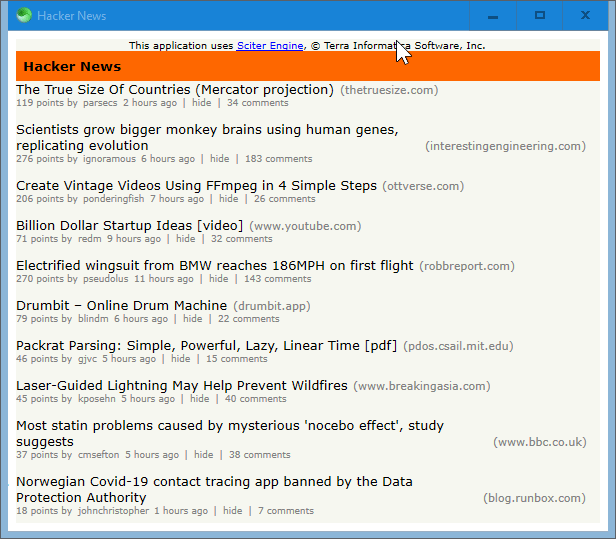

# Hacker News Minimalist Client

An extremely primitive desktop client for Hacker News made with [Sciter](https://github.com/c-smile/sciter-sdk).

Very work-in-progress.

Artifically limits stories and comments to 10 or less.

No signup or login functionality.

## Motivation

Learn the basics of Sciter's [Reactor](https://sciter.com/developers/sciter-docs/reactor-and-ssx/).

## Usage

Run [scapp.exe](https://github.com/c-smile/sciter-sdk/tree/master/bin.win/x64) inside this folder.

## Preview

;

## Todo

- [ ] Lazy loading
- [ ] Back button
- [ ] Hours ago
- [ ] Comment children
